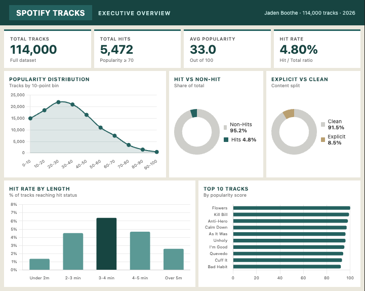
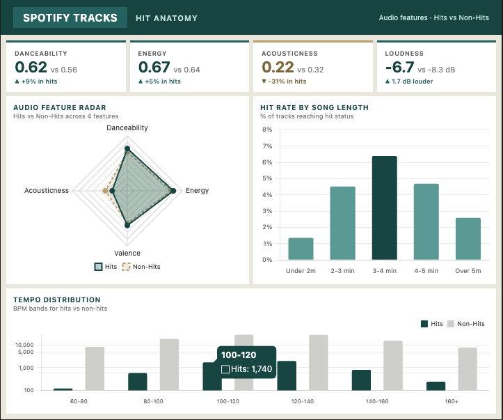
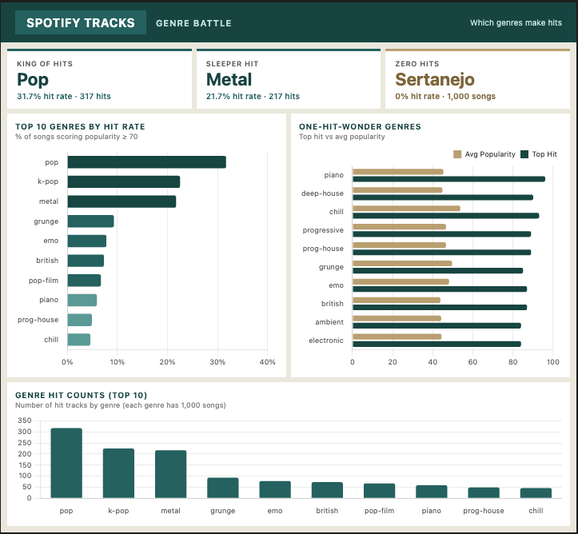
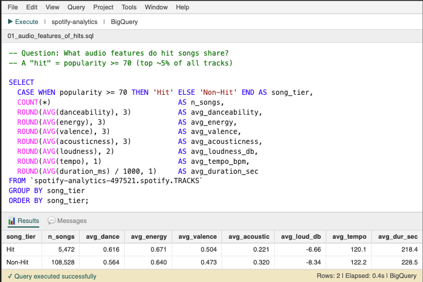
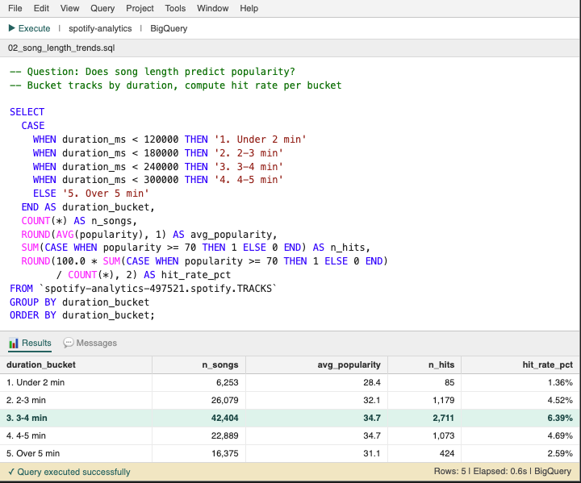
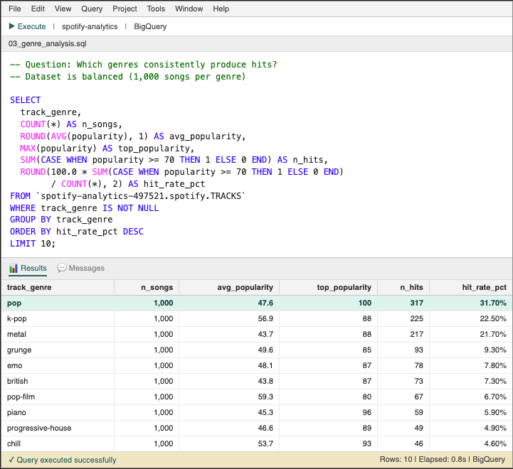
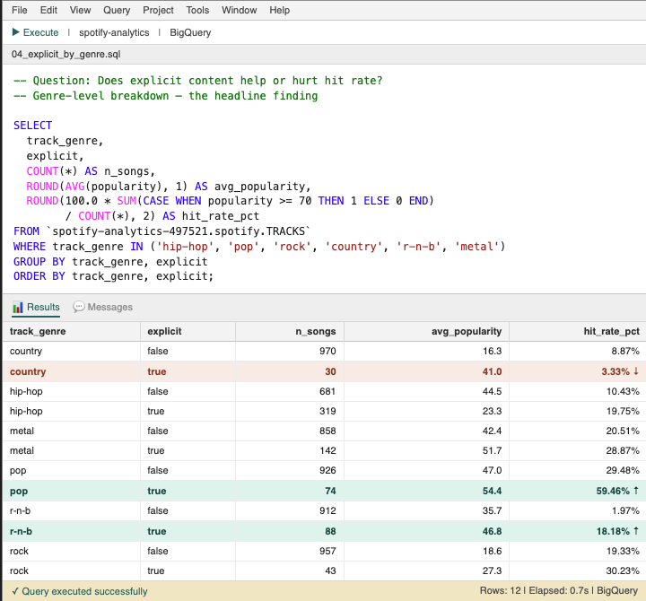
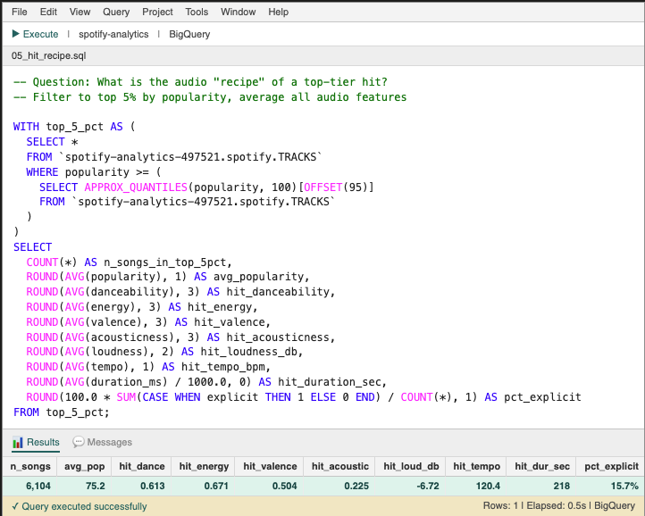

# What Makes a Hit Song? — Spotify Analytics

A data analysis project uncovering the audio features, song length, genres, and content characteristics that distinguish hit songs from the rest. Built with **SQL on BigQuery** and visualized with **Power BI**.

**Dataset:** 114,000 Spotify tracks from Kaggle
**Hit definition:** popularity score ≥ 70 on Spotify's 0-100 scale
**Stack:** BigQuery (SQL), Power BI

---

## TL;DR — Six findings worth remembering

1. **Only 4.8% of tracks are hits.** Out of 114,000 songs, just 5,472 cross the popularity threshold.
2. **Acousticness is the biggest signal.** Hit songs are 31% less acoustic than non-hits — the largest feature gap of any audio dimension.
3. **3-4 minute songs win.** Songs in that range hit at 6.39% vs 1.36% for songs under 2 minutes.
4. **Pop (31.7%) > K-pop (22.5%) > Metal (21.7%).** Metal is the sleeper success.
5. **Explicit content boosts hit rate — except in country.** Pop nearly doubles (29.5% → 59.5%), R&B gets a 9x boost (1.97% → 18.18%), but in country, explicit content cuts hit rate from 8.87% to 3.33%.
6. **The hit recipe (top 5% of tracks):** 120 BPM, 3:38 long, danceability 0.61, energy 0.67, low acousticness (0.22), mastered loud at -6.7 dB.

---

## The Dashboard

A 4-page Power BI dashboard tells the full story.

### Page 1 — Executive Overview

The 30,000-foot view. KPIs up top, popularity distribution, hit-vs-non-hit share, top 10 most popular tracks.

### Page 2 — Hit Anatomy

What audio features actually separate a hit from a non-hit? Radar chart shows hits are more danceable, more energetic, less acoustic. The 3-4 minute sweet spot is visible in the length chart on the right.

### Page 3 — Genre Battle

Which genres consistently produce hits? Pop dominates at 31.7% hit rate, k-pop and metal follow. The "one-hit-wonder" chart reveals genres where one mega-hit drags up the average while most songs flop.

### Page 4 — The Hit Recipe

The headline finding. From the top 5% of all tracks, here's the audio profile of a hit song. The explicit-by-genre chart shows the country reversal — every other genre rewards explicit content, but country cuts hit rate in half.

---

## The SQL Behind It

Five queries, run on BigQuery. Each query and its actual returned results are below.

### Query 1 — Audio Features of Hits vs Non-Hits

Compares average audio features for hits (popularity ≥ 70) vs non-hits across the full dataset.

**Finding:** Hits are 9% more danceable, 31% less acoustic, and 1.7 dB louder than non-hits. Acousticness is the single biggest signal — production matters more than tempo.

### Query 2 — Song Length Trends

Buckets tracks by duration to find the sweet spot.

**Finding:** Songs in the 3-4 minute range hit at 6.39% — nearly 5x the rate of songs under 2 minutes (1.36%). Under-2-min and over-5-min songs are near-guaranteed flops.

### Query 3 — Genre Hit Rates

Top 10 genres by hit rate (dataset is balanced at 1,000 songs per genre, making comparison fair).

**Finding:** Pop wins (31.7%). Metal is the surprise at 21.7% — outperforming grunge, emo, and electronic.

### Query 4 — Explicit Content by Genre (the headline)

Compares hit rate for explicit vs non-explicit songs within 6 major genres.

**Finding:** Pop doubles its hit rate with explicit content (29.48% → 59.46%). R&B gets a 9x boost (1.97% → 18.18%). But country is the only genre where explicit content REDUCES hit rate (8.87% → 3.33%). The genre context matters more than the content itself.

### Query 5 — The Hit Recipe

Filters to the top 5% of tracks and averages every audio feature to characterize the elite profile.

**Finding:** 120 BPM, 3:38 long, danceability 0.61, energy 0.67, low acousticness, mastered loud at -6.7 dB. Only 15.7% are explicit — meaning explicit content isn't a hit-maker on its own, just a multiplier in specific genres.

---

## Repository Structure

spotify-hit-analysis/
├── README.md
├── sql/
│   ├── 01_audio_features_of_hits.sql
│   ├── 02_song_length_trends.sql
│   ├── 03_genre_analysis.sql
│   ├── 04_explicit_by_genre.sql
│   └── 05_hit_recipe.sql
└── images/
├── 01_overview.png
├── 02_hit_anatomy.png
├── 03_genre_battle.png
├── 04_the_recipe.png
├── SPOTIFY1.PNG
├── SPOTIFY2.PNG
├── SPOTIFY3.PNG
├── SPOTIFY4.PNG
└── SPOTIFY5.PNG

---

## How to Reproduce

1. Download the dataset from Kaggle: [Spotify Tracks Dataset](https://www.kaggle.com/datasets/maharshipandya/-spotify-tracks-dataset)
2. Load it into BigQuery as a table named `TRACKS` in your project's `spotify` dataset
3. Run the SQL files in `sql/` in order
4. Connect Power BI to BigQuery to rebuild the dashboard (or just view the screenshots above)

---

## Methodology Notes

**Sample balance:** The dataset is balanced at 1,000 songs per genre, making cross-genre comparisons fair.

**Hit threshold:** "Hit" = popularity ≥ 70, which roughly captures the top 5% of tracks. Selective but with meaningful sample sizes per genre.

**Explicit-by-genre caveat:** Some explicit/genre cells have small sample sizes (e.g., 30 explicit country songs, 74 explicit pop songs). The directional findings are robust, but exact percentages have wider error bars than the headlines suggest.

**No machine learning:** This is descriptive analytics, not predictive modeling. I'm characterizing what hits look like, not building a model to predict them.

---

## What I'd Do With More Time

- Add release year analysis to see if hits are getting shorter / louder over time
- Build a hit-probability classifier (logistic regression or XGBoost) on the audio features
- Join in artist-level metrics (monthly listeners, follower count) to separate "the song is good" from "the artist is already big"

---

## About

Built by **Jaden Boothe**, B.S. Data Science at Penn State (May 2027 expected).
Part of my analytics portfolio.

LinkedIn: [linkedin.com/in/jadenboothe](https://linkedin.com/in/jadenboothe)
